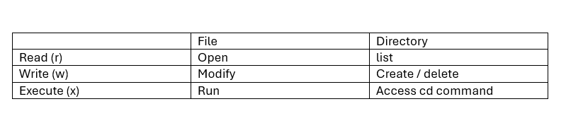
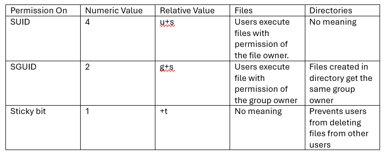
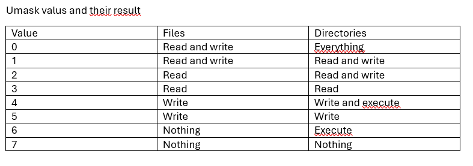

# Managing File Ownership and Permissions in Linux

This guide covers essential concepts and commands for managing file ownership and permissions in Linux systems, including special permissions and default permission settings.

## File Ownership

In Linux, every file and directory has three ownership entities:

* **User owner**: The user who created or owns the file
* **Group owner**: The primary group associated with the file
* **Others**: All other users on the system

### Key Concepts

* To determine which permissions a user has, Linux uses ownership
* Every file has a user-owner, a group-owner, and the "others" entity that is also granted permissions (ugo)
* Linux permissions are not additive - if you're the owner, only the owner permissions apply to you (not group or others)
* Use `ls -l` to display current ownership and associated permissions
* Best practice: Set ownership before modifying permissions

### Changing File Ownership

To change the ownership of files and directories, use the following commands:

```bash
# Change user ownership
chown username file

# Change user and group ownership simultaneously
chown username:groupname file

# Change only group ownership (method 1)
chown :groupname file

# Change only group ownership (method 2)
chgrp groupname file
```

### Example: Changing Ownership

```bash
# Create a directory structure
mkdir -p /DirX/files
cd /DirX

# Check current user ID and file ownership
id
ls -l

# Change user ownership
chown student files
ls -l

# Change both user and group ownership
chown student:sales files
ls -l

# Change only group ownership
chgrp wheel files
# OR
chown :sales files
ls -l
```

## Managing Permissions

The `chmod` command is used to manage file and directory permissions in Linux.

### Permission Types

* **r (read)**: Permission to read the file or list directory contents
* **w (write)**: Permission to modify the file or create/delete files in a directory
* **x (execute)**: Permission to execute the file or access files within a directory



### Using chmod

The `chmod` command can be used in two modes:

1. **Absolute (numeric) mode**: Uses numbers to represent permissions
   * 4 = read (r)
   * 2 = write (w)
   * 1 = execute (x)

   ```bash
   # Set rwx for owner, r-x for group, --- for others
   chmod 750 myfile
   ```

2. **Relative (symbolic) mode**: Uses symbols to add, remove, or set permissions
   * `+` adds a permission
   * `-` removes a permission
   * `=` sets exact permissions
   * `u` for user, `g` for group, `o` for others, `a` for all

   ```bash
   # Add execute permission for all users
   chmod +x myscript

   # Add write permission for group
   chmod g+w myfile

   # Remove write permission for others
   chmod o-w myfile
   ```

### Example: Managing Basic Permissions

```bash
# Create a user and directory
useradd bob
cd /home/bob
mkdir files

# Check current permissions
ls -l

# Set permissions using absolute mode
chmod 750 files

# Add write permission for group
chmod g+w files/

# Remove write permission for others
chmod o-w files/

# Check directory permissions
cd /home/bob
ls -ld .

# Create a file as root
touch rootFile
ls -l

# Switch to bob user and try to remove the file
su - bob
ls -l
rm -f rootFile  
```

> **Note**: The file can be deleted because the `/home/bob` directory has `rwx` permissions for the owner. Deleting a file requires write permission on the directory containing the file, not on the file itself.

## Special Permissions for Shared Directories

When members of the same group need to share files within a directory, special permissions are required for effective collaboration.

### Set Group ID (SGID)

* The SGID permission ensures that all files created in the shared group directory inherit the group ownership of the directory
* This is essential for maintaining consistent group access to new files
* Represented by `s` in the group execute position (e.g., `rwxrws---`)

### Sticky Bit

* The sticky bit permission ensures that only the file owner or the directory owner can delete or rename files
* This prevents users from deleting each other's files in shared directories
* Represented by `t` in the others execute position (e.g., `rwxrwxrwt`)



### Applying Special Permissions

```bash
# Apply SGID to a directory (symbolic mode)
chmod g+s mydir

# Apply sticky bit to a directory (symbolic mode)
chmod +t mydir

# Apply both SGID and sticky bit (absolute mode)
# The first digit represents special permissions:
# 4 = SUID, 2 = SGID, 1 = sticky bit
chmod 3770 mydir  # SGID (2) + sticky bit (1) + rwxrwx---
```

### Example: Shared Group Directory

```bash
# Create directories and groups
mkdir -p /DirY/profs /DirY/students
groupadd profs
groupadd students

# Set group ownership
chgrp profs /DirY/profs
chown :students /DirY/students

# Create users and add them to groups
useradd anna -G profs
passwd anna
useradd ali -G students
passwd ali

# Test file creation as anna
su - anna
cd /DirY/profs
touch annaFile{1..3}
ls -l
exit

# Test file deletion as ali
su - ali
rm -f /DirY/profs/annaFile1
exit

# Apply special permissions
chmod 3770 /DirY/profs  # 3 = SGID (2) + sticky bit (1)
ls -l  # Should show: drwxrws--T.

# Test file creation with SGID
su - anna
touch /DirY/profs/annaNewFile
ls -l  # Note the group ownership
exit

# Test file deletion with sticky bit
su - ali
rm -rf /DirY/profs/annaNewFile  # This should fail due to sticky bit
```

## Default Permissions with umask

The `umask` command sets the default permissions for newly created files and directories.

### How umask Works

* umask is a shell setting that subtracts from the default permissions
* Default permissions for files: 666 (rw-rw-rw-)
* Default permissions for directories: 777 (rwxrwxrwx)
* The umask value is subtracted from these defaults



### Setting umask

```bash
# Check current umask
umask

# Set a new umask for the current session
umask 027  # Owner: full access, Group: read, Others: no access

# Test the new umask
touch HiAgain
ls -l
```

### Making umask Permanent

To make umask settings permanent:

1. System-wide default: Edit `/etc/bashrc` or `/etc/profile`
2. User-specific: Edit `~/.bashrc`

```bash
# Add to ~/.bashrc for a specific user
echo "umask 077" >> ~/.bashrc

# Apply changes to current session
source ~/.bashrc
```

## Common umask Values

| umask | File Permissions | Directory Permissions | Description |
|-------|-----------------|----------------------|-------------|
| 022   | 644 (rw-r--r--) | 755 (rwxr-xr-x)     | Default on many systems |
| 027   | 640 (rw-r-----) | 750 (rwxr-x---)     | More restrictive for others |
| 077   | 600 (rw-------) | 700 (rwx------)     | Private to the owner only |
| 002   | 664 (rw-rw-r--) | 775 (rwxrwxr-x)     | Group collaborative environment |

## Best Practices

1. Always set ownership before changing permissions
2. Use SGID for shared group directories
3. Apply sticky bit to directories where multiple users can create files
4. Choose an appropriate umask based on security requirements
5. Use symbolic mode for simple permission changes and numeric mode for complex ones
6. Regularly audit permissions on sensitive files and directories
